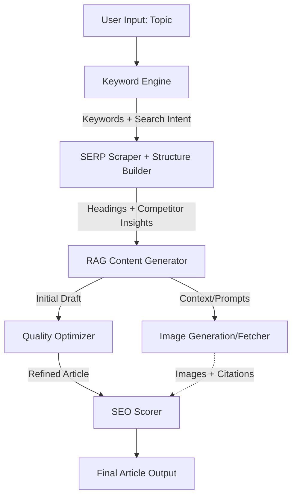

# ArticleShip: SEO-Optimized Article Generator

## Core Objective
A backend algorithm tailored for automated, SEO-optimized, high-quality article generation based on user input topics.

## Pipeline Architecture

### 1. Keyword Engine (Clusters + Intent)
- **Input:** Target topic.
- **Process:** Finds semantically related LSI keywords, long-tail variations, and identifies search intent (informational, transactional, etc.).
- **Output:** Clustered keywords ready for structural mapping.

### 2. SERP Scraper + Structure Builder
- **Process:** Scrapes top Google results for the keywords to extract prevalent heading structures (H2, H3), recurring questions (People Also Ask), and content scope.
- **Output:** A rigid, competitive article outline (Title cards/Headings).

### 3. RAG Content Generator
- **Process:** Uses Retrieval-Augmented Generation (RAG). Injects the generated keywords, intent, and structure as context into an LLM (e.g., GPT-4o, Claude 3.5 Sonnet).
- **Output:** A comprehensive first draft adhering to the exact headings and keyword density requirements.

### 4. Quality Optimizer
- **Process:** Acts as a "humanizer" and editor. Refines tone, removes AI-esque generic phrasing, enhances readability, and ensures compliance with Google's E-E-A-T (Experience, Expertise, Authoritativeness, Trustworthiness) guidelines. 

### 5. SEO Scorer (Critical)
- **Process:** Audits the optimized text against SEO standards (keyword density, readability scores, meta descriptions compliance). Flags or auto-corrects under-optimized sections.

### 6. Image Generator / Fetcher (Parallel Process)
- **Process:** Runs concurrently once headings/structure are defined. Finds relevant creative commons images (with citations) or generates native AI imagery (DALL-E 3 / Midjourney) to match the article's sections.

### 7. Final Article Output
- **Process:** Merges the optimized text, SEO metadata, and images into a final deliverable format (Markdown, HTML, or directly to a CMS like WordPress).