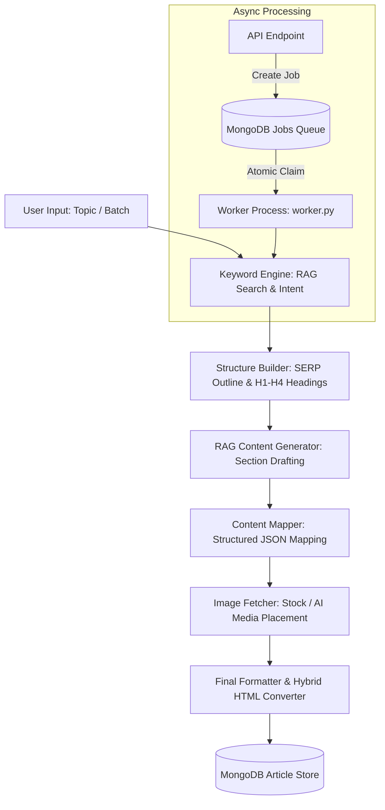

# Article.ai (ArticleShip) 🚀

[](https://fastapi.tiangolo.com/)
[](https://nextjs.org/)
[](https://www.python.org/)
[](https://www.mongodb.com/)
[](https://tailwindcss.com/)

**Article.ai** (powered by **ArticleShip**) is a full-stack, enterprise-grade AI content generation and management platform. It automates SEO research, web search grounding, structural drafting, multi-provider image fetching, hybrid HTML conversion, and asynchronous batch processing—backed by user authentication and Stripe billing.

---

## 📋 Table of Contents

- [Pipeline Architecture](#-pipeline-architecture)
- [Key Features](#-key-features)
- [Multi-LLM Fallback Architecture](#-multi-llm-fallback-architecture)
- [Background Worker & Task Queue](#-background-worker--task-queue)
- [Tech Stack](#-tech-stack)
- [Repository Structure](#-repository-structure)
- [Getting Started](#-getting-started)
- [API Endpoints Reference](#-api-endpoints-reference)
- [Environment Configuration](#-environment-configuration)
- [Testing & Verification](#-testing--verification)
- [License](#-license)

---

## 🏗️ Pipeline Architecture

<div align="center">



</div>

---

## ✨ Key Features

- 🎯 **Grounded SEO Engine**: Performs live search grounding (DuckDuckGo, Tavily, Exa, Brave) to extract search intent, LSI keywords, and competitor heading structures.
- 📝 **Structured Article Generation**: Generates comprehensive, E-E-A-T compliant articles with target word counts (500, 1000, 1500, 2500 words).
- 🖼️ **Smart Image Fetching**: Dynamically embeds stock photos (Unsplash / Google Custom Search) or AI-generated images (Pollen API) with proper credits and captions.
- 🎨 **Hybrid HTML Rendering**: Produces semantic, class-structured HTML with optional inline CSS styling for direct CMS, RSS, or platform publishing.
- 📦 **Batch & Scheduled Queue**: Process up to 20 topics simultaneously with optional time staggering (`stagger_minutes`) and future execution (`scheduled_at`).
- 🔒 **Auth & Subscription Management**: Email OTP verification, JWT session authentication, password security (bcrypt), and Stripe checkout/billing portal integration.

---

## 🤖 Multi-LLM Fallback Architecture

`services/llm_client.py` provides a unified multi-provider client with automatic fallback routing and transient error handling:

<div align="center">

```
[Primary: Gemini 3 Flash]
       │
       ├── (On 429 Rate Limit / 503 Overload) ──> Automatic Retry with Linear Backoff
       │
       └── (If Primary Fails) ──> [Fallback 1: OpenRouter (openrouter/free)]
                                         │
                                         └── (If Fails) ──> [Fallback 2: NVIDIA NIM (Kimi k2.6)]
                                                                    │
                                                                    └── (If Fails) ──> [Fallback 3: Qwen (qwen-plus)]
```

</div>

- **Resilient Fallback**: Automatically cascades down configured API keys to guarantee 99.9% pipeline uptime.
- **JSON Truncation Auto-Correction**: Detects model token truncation and retries requests with doubled max token headroom.

---

## ⚡ Background Worker & Task Queue

The `worker.py` consumer manages long-running background tasks safely:

- **Atomic Queue Claims**: Uses MongoDB `find_one_and_update` as an atomic lock mechanism so multiple worker instances never process the same job.
- **Stale Job Recovery**: Reclaims jobs stuck in `processing` longer than 20 minutes (up to 2 attempts) in case of worker crashes.
- **Cost & Token Tracking**: Logs LLM call counts and image generation metrics per job (`job_cost`).

---

## 🛠️ Tech Stack

- **Backend**: Python 3.10+, FastAPI, Uvicorn, PyMongo, Pydantic v2, `python-jose`, `bcrypt`, `stripe`
- **Frontend**: Next.js 14 (App Router), React 18, TypeScript, Tailwind CSS, Lucide Icons
- **Database**: MongoDB (Articles, Jobs, Batches, Users, Style Models)
- **LLM Integrations**: Google Gemini (`google-genai`), OpenRouter, NVIDIA NIM, Qwen (`openai` client)

---

## 📂 Repository Structure

```text
Article.ai/
├── ArticleShip/                   # FastAPI Backend & Queue Worker
│   ├── main.py                    # API Gateway & Route Handlers
│   ├── worker.py                  # Background Job Queue Processor
│   ├── services/                  # Core Business & Pipeline Logic
│   │   ├── article_builder.py     # Article drafting & search retrieval
│   │   ├── article_store.py       # MongoDB CRUD for articles & jobs
│   │   ├── keyword_engine.py      # SEO keyword research & intent
│   │   ├── structure_builder.py   # Outline generator
│   │   ├── image_fetcher.py       # Stock & AI image embedding
│   │   ├── hybrid_html_converter.py# Markdown to hybrid HTML converter
│   │   ├── llm_client.py          # Unified multi-LLM client with failover
│   │   ├── payment_service.py     # Stripe integration
│   │   └── search/                # Web search grounding providers
│   └── requirements.txt           # Python dependencies
└── Frontend/                      # Next.js 14 Frontend Application
    ├── app/                       # App Router pages & API proxies
    ├── components/                # Reusable UI components
    └── package.json               # Node.js dependencies
```

---

## 🚀 Getting Started

### Prerequisites
- **Python 3.10+** & **Node.js 18+**
- **MongoDB** instance (Local or Atlas)
- **Google Gemini API Key** (`GEMINI_API_KEY`)

---

### 1. Backend & Worker Setup (`ArticleShip`)

```bash
cd ArticleShip

# Setup virtual environment & dependencies
python3 -m venv .venv
source .venv/bin/activate
pip install -r requirements.txt

# Configure environment variables
cp .env.example .env

# Start API Server (http://localhost:8000)
python main.py

# In a separate terminal, start the background worker:
source .venv/bin/activate
python worker.py
```

---

### 2. Frontend Setup (`Frontend`)

```bash
cd Frontend

# Install dependencies & set environment
npm install
cp .env.example .env.local

# Start Next.js development server (http://localhost:3000)
npm run dev
```

---

## 🔌 API Endpoints Reference

| Module | Method | Endpoint | Description |
| :--- | :---: | :--- | :--- |
| **Auth** | `POST` | `/api/v1/auth/signup` | Register account & email OTP code |
| | `POST` | `/api/v1/auth/verify-otp` | Verify OTP & receive JWT access token |
| | `POST` | `/api/v1/auth/login` | Authenticate & set refresh cookie |
| **Pipeline** | `POST` | `/api/v1/keywords` | Discover SEO keyword cluster |
| | `POST` | `/api/v1/structure` | Generate outline structure |
| | `POST` | `/api/v1/generate_full_article_hybrid_html` | Queue background article generation |
| **Jobs & Batches**| `GET` | `/api/v1/jobs` | List user background jobs |
| | `POST` | `/api/v1/jobs/{id}/retry` | Retry failed generation job |
| | `POST` | `/api/v1/batches` | Submit bulk topics for batch execution |
| **Article CMS** | `GET` | `/api/v1/articles` | List published/draft articles |
| | `POST` | `/api/v1/articles/{id}/publish` | Publish draft article with slug |
| **Billing** | `POST` | `/api/v1/billing/checkout` | Create Stripe checkout session |

---

## ⚙️ Environment Configuration

Key variables in `ArticleShip/.env`:

| Variable | Required | Description |
| :--- | :---: | :--- |
| `GEMINI_API_KEY` | **Yes** | Primary LLM key for Gemini 3 Flash |
| `MONGODB_URI` | **Yes** | MongoDB connection string |
| `JWT_SECRET_KEY` | **Yes** | JWT token signing key |
| `OPENROUTER_API_KEY` / `NVIDIA_API_KEY` / `QWEN_API_KEY` | No | Fallback LLM provider keys |
| `UNSPLASH_ACCESS_KEY` / `GOOGLE_SEARCH_API_KEY` | No | Stock image search credentials |
| `STRIPE_SECRET_KEY` / `STRIPE_WEBHOOK_SECRET` | No | Stripe checkout and webhook keys |

Key variable in `Frontend/.env.local`:
- `BACKEND_BASE_URL`: Base URL of the FastAPI backend (`http://127.0.0.1:8000`)

---

## 🧪 Testing & Verification

Run automated test scripts inside `ArticleShip/`:

```bash
cd ArticleShip
source .venv/bin/activate

# Test generation pipeline logic
python test_individual.py

# Test OTP authentication flow
python test_otp_auth.py

# Test job ownership & scoping security
python test_article_ownership.py
```

---

## 📄 License

Proprietary and confidential. All rights reserved.
