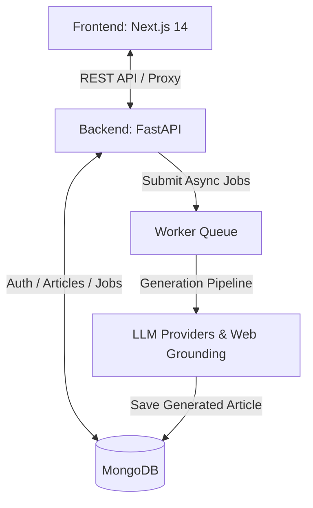

# Article.ai 🚀

[](https://fastapi.tiangolo.com/)
[](https://nextjs.org/)
[](https://www.python.org/)
[](https://www.mongodb.com/)

**Article.ai** is a full-stack, AI-powered platform for generating and managing SEO-optimized, highly structured articles at scale. It combines automated SERP research, keyword intent analysis, multi-provider image fetching, hybrid HTML formatting, background batch processing, and built-in user authentication with Stripe billing.

---

## 📋 Table of Contents

- [Key Features](#-key-features)
- [Architecture](#-architecture)
- [Project Structure](#-project-structure)
- [Quick Start](#-quick-start)
  - [Prerequisites](#prerequisites)
  - [1. Backend & Worker Setup](#1-backend--worker-setup-articleship)
  - [2. Frontend Setup](#2-frontend-setup-frontend)
- [Environment Variables Summary](#-environment-variables-summary)
- [License](#-license)

---

## ✨ Key Features

- 🎯 **SEO & E-E-A-T Generation**: Live search grounding for keyword clusters, LSI terms, and intent-focused article structures.
- 🔄 **Multi-LLM Resilience**: Automated failover chain across **Google Gemini**, **OpenRouter**, **NVIDIA NIM**, and **Qwen**.
- 📦 **Batch & Scheduled Queue**: Asynchronous processing for up to 20 topics with configurable staggering and scheduled execution.
- 🖼️ **Stock & AI Media**: Automatic embedding of Unsplash, Google Custom Search, or AI-generated imagery with attribution metadata.
- 🎨 **Hybrid HTML Output**: Portable HTML exports featuring structured CSS classes and inline styling for CMS or RSS publishing.
- 🔒 **Auth & Billing**: Email OTP verification, JWT session handling, and Stripe subscription tier management.

---

## 🏗️ Architecture



---

## 📂 Project Structure

```text
Article.ai/
├── ArticleShip/           # FastAPI backend & async worker
│   ├── main.py            # REST API endpoints
│   ├── worker.py          # Background task consumer
│   ├── services/          # Core generation & integration modules
│   └── requirements.txt   # Python dependencies
└── Frontend/              # Next.js web application
    ├── app/               # App Router pages & API proxy routes
    ├── components/        # Reusable UI components
    └── package.json       # Node.js dependencies
```

---

## 🚀 Quick Start

### Prerequisites
- **Python 3.10+** & **Node.js 18+**
- **MongoDB** instance
- **Google Gemini API Key**

---

### 1. Backend & Worker Setup (`ArticleShip`)

```bash
cd ArticleShip

# Create virtual environment & install dependencies
python3 -m venv .venv
source .venv/bin/activate
pip install -r requirements.txt

# Configure environment variables
cp .env.example .env

# Run API server (http://localhost:8000)
python main.py

# In a separate terminal, start the background worker:
source .venv/bin/activate
python worker.py
```

---

### 2. Frontend Setup (`Frontend`)

```bash
cd Frontend

# Install dependencies & set environment
npm install
cp .env.example .env.local

# Run development server (http://localhost:3000)
npm run dev
```

---

## ⚙️ Environment Variables Summary

Key variables required in `ArticleShip/.env`:

- `GEMINI_API_KEY`: Google Gemini API key (*Required*)
- `MONGODB_URI`: MongoDB connection string (*Required*)
- `JWT_SECRET_KEY`: Secret key for JWT tokens (*Required*)
- `UNSPLASH_ACCESS_KEY` / `GOOGLE_SEARCH_API_KEY`: Image fetcher configuration
- `STRIPE_SECRET_KEY` / `STRIPE_WEBHOOK_SECRET`: Billing integration

Key variable required in `Frontend/.env.local`:

- `BACKEND_BASE_URL`: Base URL of the FastAPI backend (`http://127.0.0.1:8000`)

---

## 📄 License

Proprietary and confidential. All rights reserved.
